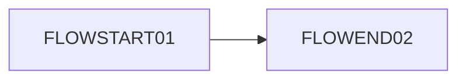
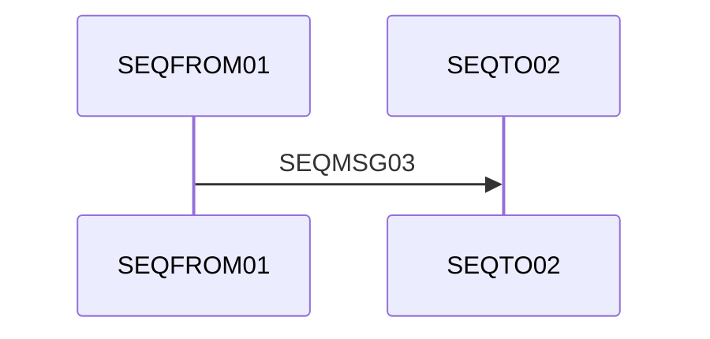

# MarsDawn README HDMAIN01

繁體中文介紹段落 CJKINTRO01：這是一段測試文字，用來檢查匯出功能是否正常運作。

## Features TBLHEAD01

| Feature KeyA01 | Status ValA02 |
|---|---|
| Live preview CELLA03 | Done CELLB04 |

## Tasks TASKHEAD01

- [x] Ship the exporter DONETASK01
- [ ] Add DOCX support OPENTASK02

> A quoted note QUOTE01 from the maintainers.

```swift
let codeMARKER01 = 42
```






Last paragraph in the document ENDMARK99.
