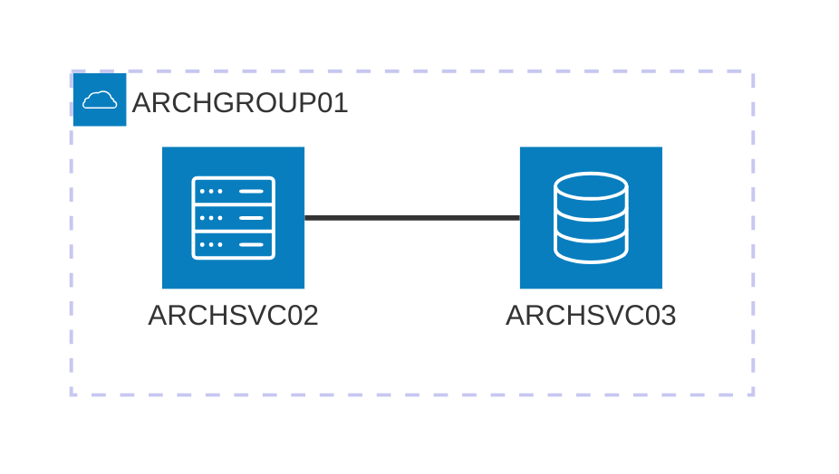

# Mermaid architecture

Before marker BEFOREarchitecture.

```mermaid
architecture-beta
  group ARCHGROUP01(cloud)[ARCHGROUP01]
  service ARCHSVC02(server)[ARCHSVC02] in ARCHGROUP01
  service ARCHSVC03(database)[ARCHSVC03] in ARCHGROUP01
  ARCHSVC02:R -- L:ARCHSVC03
```

After marker AFTERarchitecture.
