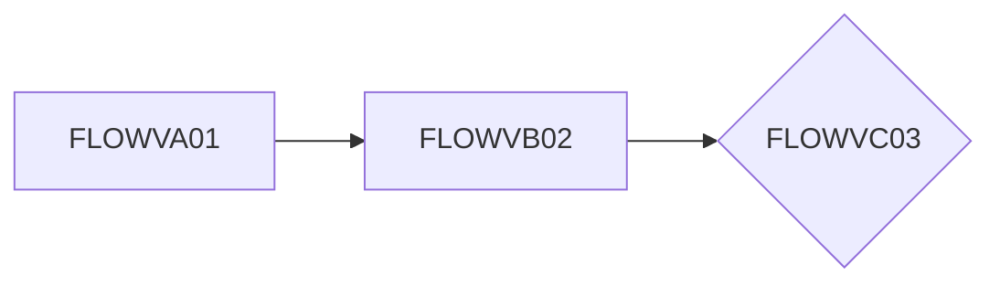

# Mermaid flowchart-v2

Before marker BEFOREflowchart-v2.

```mermaid
flowchart LR
  FLOWVA01[FLOWVA01] --> FLOWVB02[FLOWVB02]
  FLOWVB02 --> FLOWVC03{FLOWVC03}
```

After marker AFTERflowchart-v2.
