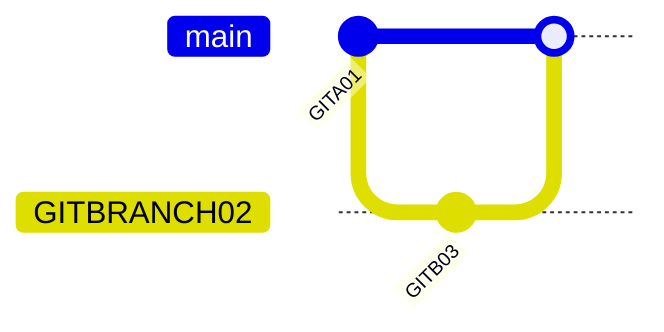

# Mermaid gitGraph

Before marker BEFOREgitGraph.

```mermaid
gitGraph
  commit id: "GITA01"
  branch GITBRANCH02
  commit id: "GITB03"
  checkout main
  merge GITBRANCH02
```

After marker AFTERgitGraph.
