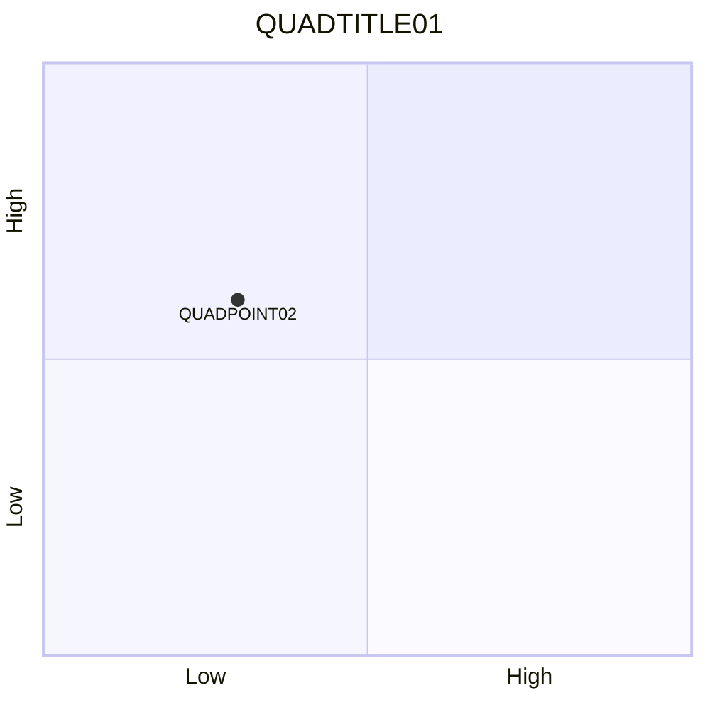

# Mermaid quadrantChart

Before marker BEFOREquadrantChart.

```mermaid
quadrantChart
  title QUADTITLE01
  x-axis Low --> High
  y-axis Low --> High
  QUADPOINT02: [0.3, 0.6]
```

After marker AFTERquadrantChart.
