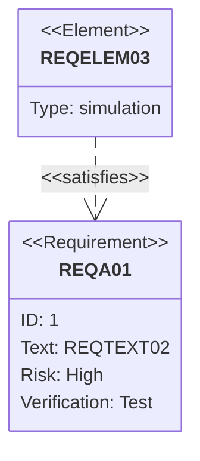

# Mermaid requirement

Before marker BEFORErequirement.

```mermaid
requirementDiagram
  requirement REQA01 {
    id: 1
    text: REQTEXT02
    risk: high
    verifymethod: test
  }
  element REQELEM03 {
    type: simulation
  }
  REQELEM03 - satisfies -> REQA01
```

After marker AFTERrequirement.
