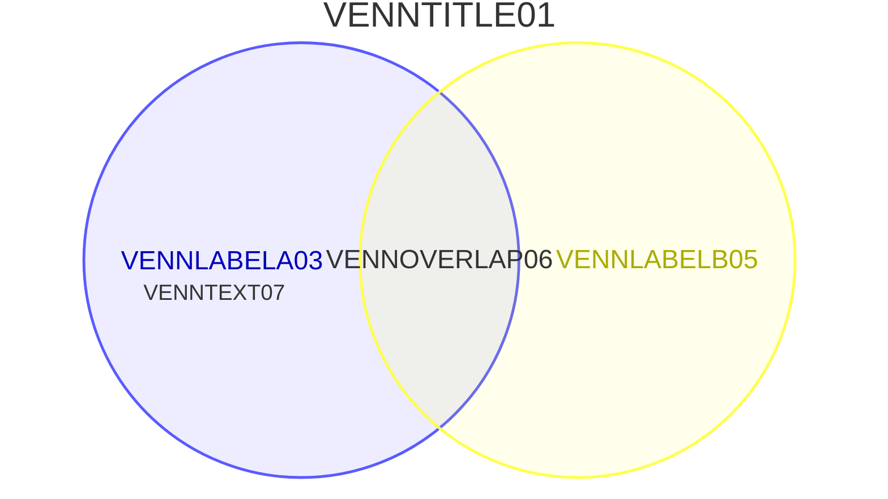

# Mermaid venn

Before marker BEFOREvenn.

```mermaid
venn-beta
title VENNTITLE01
set VENNA02["VENNLABELA03"]
set VENNB04["VENNLABELB05"]
union VENNA02,VENNB04["VENNOVERLAP06"]
text VENNA02 "VENNTEXT07"
```

After marker AFTERvenn.
